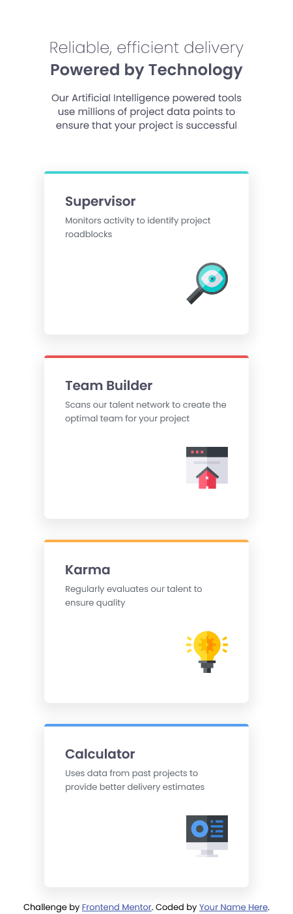
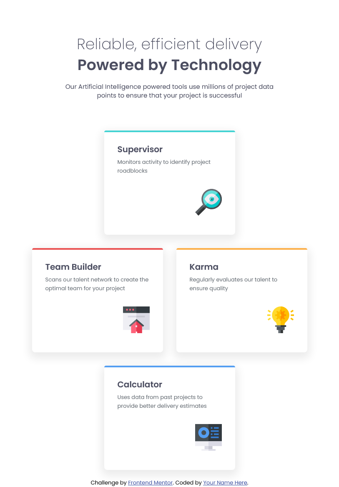
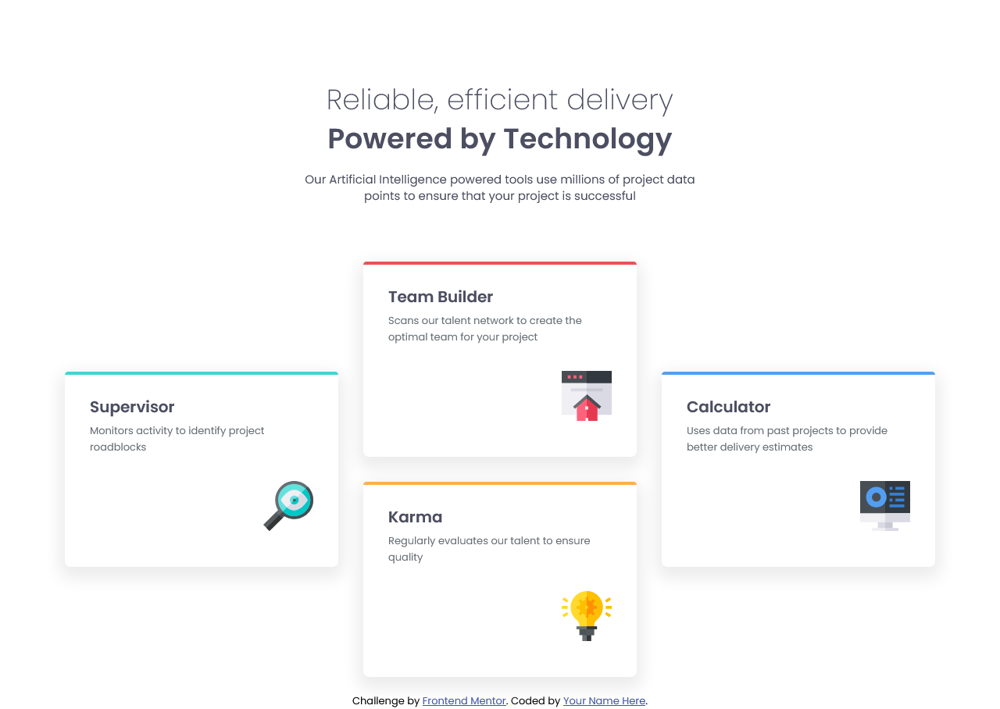

# Frontend Mentor - Four card feature section solution
This is a solution to the [Four card feature section challenge on Frontend Mentor](https://www.frontendmentor.io/challenges/four-card-feature-section-weK1eFYK). Frontend Mentor challenges help you improve your coding skills by building realistic projects. 

## Table of contents
- [Overview](#overview)
  - [Screenshot](#screenshot)
  - [Links](#links)
- [My process](#my-process)
  - [Built with](#built-with)
  - [What I learned](#what-i-learned)
  - [Continued development](#continued-development)
  - [Useful resources](#useful-resources)
- [Author](#author)
- [Acknowledgments](#acknowledgments)

## Overview
This is just a Four card feature section challenge made with basic HTML and CSS.
I would be very grateful for any feedback!

### Screenshot

### Links
Solution URL: https://github.com/Ant105/Four-card-feature-section
Live Site URL: https://ant105.github.io/Four-card-feature-section/

## My process

### Built with
Just basic HTML/CSS, variables for colors, Grid

### What I learned
-

### Continued development
-

### Useful resources
-

## Author
-

## Acknowledgments
-